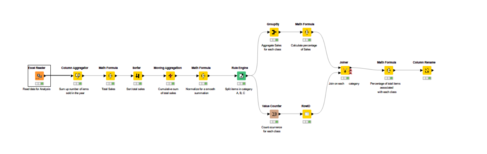

### ABC-анализ через KNIME
Этот рабочий процесс демонстрирует простой метод анализа ABC. Он классифицирует продажи товаров в зависимости от выбранных интервалов нормализованных накопленных продаж. 
Таким образом, сумма продаж:
- от 0 до 0,6 классифицируется как A
- от 0,6 до 0,85 как B 
- выше 0,85 как C

