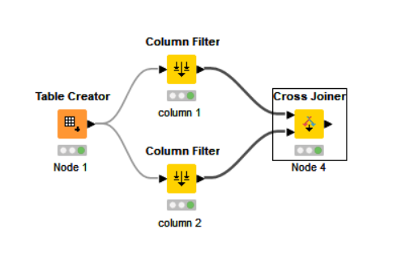

# Декартово или прямое произведение двух множеств
Ниже мы реализуем операцию декартова произведения с помощью последовательности из трех узлов, быстро, эффективно и просто.

Декартово произведение — это математическая операция, в которой из двух множеств создается третье множество, 
состоящее из всех возможных упорядоченных пар элементов из исходных множеств. В контексте данных это означает, ч
то мы комбинируем каждый элемент из одного набора данных со всеми элементами из другого набора данных, создавая новую таблицу с всеми возможными комбинациями.

A × B × C = {(x, y, z) | x ∈ A, y ∈ B, z ∈ C}.

